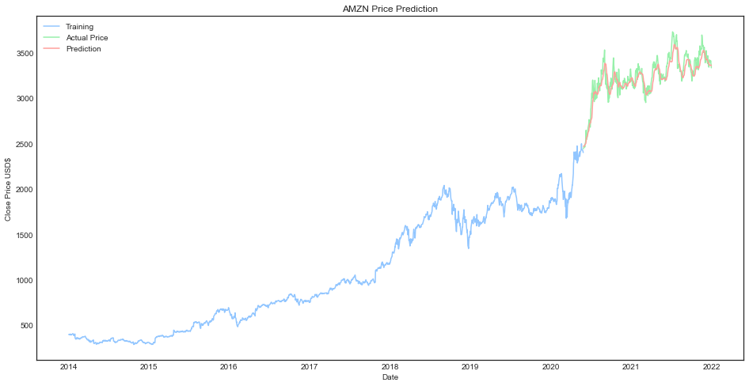

# Stock-Price-Predictor

This program predicts the future price of a stock

***Note: Please excuse the large amounts of comments in my code, it's for future revision***

## How it works

Six years of stock data gathered from Yahoo finance is used for training data. The program then displays the prediction graph using the matplot library and compares it to the program's estimate to determine accuracy

## Execution

After inputting a stocks ticker symbol, the program will run, display the graph, and return a final next-day stock prediction in the terminal

### Amazon Example

### Apple Example

